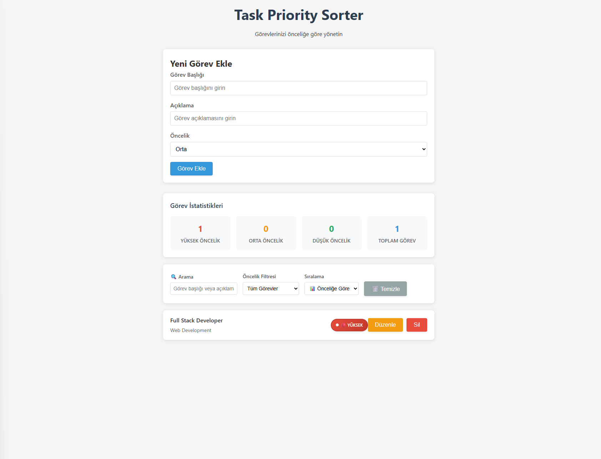
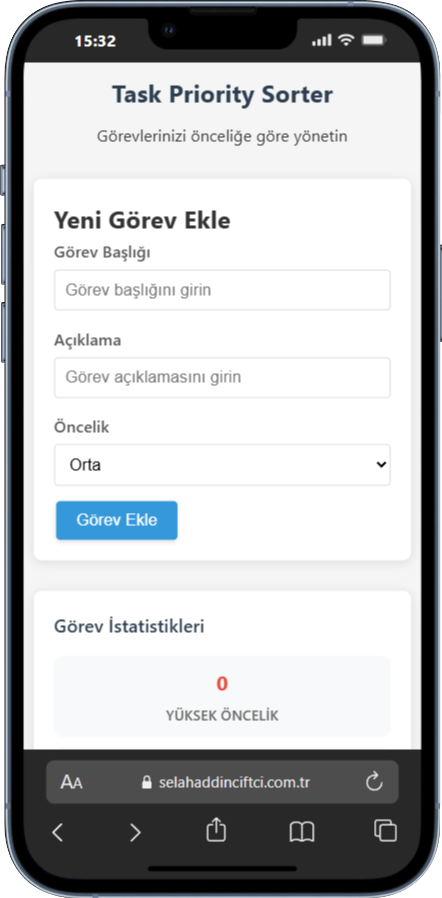

# 📋 Task Priority Sorter

<div align="center">
  
  
  
  
</div>

<div align="center">
  <h3>🇹🇷 Türkçe | 🇺🇸 English | 🇩🇪 Deutsch</h3>
</div>

---

## 🇹🇷 Türkçe

### 📖 Proje Açıklaması

**Task Priority Sorter**, görevlerinizi öncelik seviyelerine göre yönetmenizi sağlayan modern bir web uygulamasıdır. React ve localStorage kullanarak geliştirilmiş, tamamen istemci tarafında çalışan bir görev yönetim sistemidir.

### ✨ Özellikler

- 🎯 **CRUD İşlemleri**: Görev ekleme, düzenleme, silme
- 🔥 **Öncelik Sistemi**: Yüksek, Orta, Düşük öncelik seviyeleri
- 🔍 **Gelişmiş Arama**: Başlık ve açıklamada gerçek zamanlı arama
- 📊 **Filtreleme & Sıralama**: Öncelik, başlık ve tarihe göre sıralama
- 📱 **Responsive Tasarım**: Mobil, tablet ve masaüstü uyumlu
- 💾 **Veri Kalıcılığı**: localStorage ile otomatik kaydetme
- 🎨 **Modern UI/UX**: Hover efektleri, animasyonlar ve bildirimler
- ♿ **Erişilebilirlik**: ARIA etiketleri ve klavye desteği

### 🚀 Demo

**Canlı Demo:** [Task Priority Sorter Demo](https://selahaddinciftci.com.tr/project/Task-Priority-Sorter/)

### 📸 Ekran Görüntüleri

<div align="center">
  
  <p><em>Ana görev yönetim ekranı</em></p>
</div>

<div align="center">
  
  <p><em>Mobil uyumlu tasarım</em></p>
</div>

### 🛠️ Teknolojiler

- **Frontend**: React 18, JavaScript ES6+
- **Styling**: CSS3 (Flexbox, Grid, Animations)
- **Storage**: localStorage API
- **Build**: Vanilla JavaScript (CDN)

### 📁 Proje Yapısı

```
task-priority-sorter/
├── 📄 index.html              # Ana HTML dosyası
├── 📁 css/
│   └── 🎨 style.css           # Stil dosyası
├── 📁 js/
│   ├── ⚛️ app.js              # Ana React uygulaması
│   ├── 📁 components/
│   │   ├── 📋 TaskList.js     # Görev listesi bileşeni
│   │   └── 📝 TaskItem.js     # Görev öğesi bileşeni
│   └── 📁 utils/
│       └── 💾 storage.js      # localStorage yardımcı fonksiyonları
└── 📖 README.md               # Proje dokümantasyonu
```

### 🚀 Kurulum ve Çalıştırma

1. **Projeyi klonlayın:**
   ```bash
   git clone https://github.com/kodusta/Task-Priority-Sorter.git
   cd Task-Priority-Sorter
   ```

2. **Tarayıcıda açın:**
   ```bash
   # Basitçe index.html dosyasını tarayıcıda açın
   open index.html
   ```

3. **Görevlerinizi yönetmeye başlayın!**

### 💡 Kullanım

1. **Görev Ekleme**: Formu doldurarak yeni görev ekleyin
2. **Öncelik Belirleme**: Yüksek, Orta veya Düşük öncelik seçin
3. **Arama**: Görev başlığı veya açıklamasında arama yapın
4. **Filtreleme**: Öncelik seviyelerine göre filtreleyin
5. **Sıralama**: Öncelik, başlık veya tarihe göre sıralayın

---

## 🇺🇸 English

### 📖 Project Description

**Task Priority Sorter** is a modern web application that helps you manage your tasks based on priority levels. Built with React and localStorage, it's a fully client-side task management system.

### ✨ Features

- 🎯 **CRUD Operations**: Add, edit, delete tasks
- 🔥 **Priority System**: High, Medium, Low priority levels
- 🔍 **Advanced Search**: Real-time search in titles and descriptions
- 📊 **Filtering & Sorting**: Sort by priority, title, and date
- 📱 **Responsive Design**: Mobile, tablet, and desktop compatible
- 💾 **Data Persistence**: Automatic saving with localStorage
- 🎨 **Modern UI/UX**: Hover effects, animations, and notifications
- ♿ **Accessibility**: ARIA labels and keyboard support

### 🚀 Demo

**Live Demo:** [Task Priority Sorter Demo](https://selahaddinciftci.com.tr/project/Task-Priority-Sorter/)

### 🛠️ Technologies

- **Frontend**: React 18, JavaScript ES6+
- **Styling**: CSS3 (Flexbox, Grid, Animations)
- **Storage**: localStorage API
- **Build**: Vanilla JavaScript (CDN)

### 🚀 Installation and Running

1. **Clone the project:**
   ```bash
   git clone https://github.com/kodusta/Task-Priority-Sorter.git
   cd Task-Priority-Sorter
   ```

2. **Open in browser:**
   ```bash
   # Simply open index.html in your browser
   open index.html
   ```

3. **Start managing your tasks!**

### 💡 Usage

1. **Add Task**: Fill the form to add new tasks
2. **Set Priority**: Choose High, Medium, or Low priority
3. **Search**: Search in task titles or descriptions
4. **Filter**: Filter by priority levels
5. **Sort**: Sort by priority, title, or date

---

## 🇩🇪 Deutsch

### 📖 Projektbeschreibung

**Task Priority Sorter** ist eine moderne Webanwendung, die Ihnen hilft, Ihre Aufgaben nach Prioritätsstufen zu verwalten. Mit React und localStorage entwickelt, ist es ein vollständig clientseitiges Aufgabenverwaltungssystem.

### ✨ Funktionen

- 🎯 **CRUD-Operationen**: Aufgaben hinzufügen, bearbeiten, löschen
- 🔥 **Prioritätssystem**: Hohe, Mittlere, Niedrige Prioritätsstufen
- 🔍 **Erweiterte Suche**: Echtzeitsuche in Titeln und Beschreibungen
- 📊 **Filterung & Sortierung**: Sortieren nach Priorität, Titel und Datum
- 📱 **Responsive Design**: Mobil-, Tablet- und Desktop-kompatibel
- 💾 **Datenpersistenz**: Automatisches Speichern mit localStorage
- 🎨 **Modernes UI/UX**: Hover-Effekte, Animationen und Benachrichtigungen
- ♿ **Barrierefreiheit**: ARIA-Labels und Tastaturunterstützung

### 🚀 Demo

**Live-Demo:** [Task Priority Sorter Demo](https://selahaddinciftci.com.tr/project/Task-Priority-Sorter/)

### 🛠️ Technologien

- **Frontend**: React 18, JavaScript ES6+
- **Styling**: CSS3 (Flexbox, Grid, Animationen)
- **Storage**: localStorage API
- **Build**: Vanilla JavaScript (CDN)

### 🚀 Installation und Ausführung

1. **Projekt klonen:**
   ```bash
   git clone https://github.com/kodusta/Task-Priority-Sorter.git
   cd Task-Priority-Sorter
   ```

2. **Im Browser öffnen:**
   ```bash
   # Öffnen Sie einfach index.html in Ihrem Browser
   open index.html
   ```

3. **Beginnen Sie mit der Aufgabenverwaltung!**

### 💡 Verwendung

1. **Aufgabe hinzufügen**: Formular ausfüllen, um neue Aufgaben hinzuzufügen
2. **Priorität festlegen**: Hohe, Mittlere oder Niedrige Priorität wählen
3. **Suchen**: In Aufgabentiteln oder -beschreibungen suchen
4. **Filtern**: Nach Prioritätsstufen filtern
5. **Sortieren**: Nach Priorität, Titel oder Datum sortieren

---

## 📈 Geliştirme Aşamaları / Development Phases / Entwicklungsphasen

### ✅ Tamamlanan Aşamalar / Completed Phases / Abgeschlossene Phasen

- [x] **Phase 1**: Proje yapısı ve temel HTML / Project structure and basic HTML / Projektstruktur und grundlegendes HTML
- [x] **Phase 2**: Temel React bileşenleri / Basic React components / Grundlegende React-Komponenten
- [x] **Phase 3**: CRUD işlemleri ve localStorage / CRUD operations and localStorage / CRUD-Operationen und localStorage
- [x] **Phase 4**: Öncelik sistemi ve filtreleme / Priority system and filtering / Prioritätssystem und Filterung
- [x] **Phase 5**: Sıralama ve gelişmiş filtreleme / Sorting and advanced filtering / Sortierung und erweiterte Filterung
- [x] **Phase 6**: UI/UX iyileştirmeleri / UI/UX improvements / UI/UX-Verbesserungen

## 🤝 Katkıda Bulunma / Contributing / Beitragen

1. Fork yapın / Fork the project / Projekt forken
2. Feature branch oluşturun / Create your feature branch / Feature-Branch erstellen
3. Commit yapın / Commit your changes / Änderungen committen
4. Push yapın / Push to the branch / Zum Branch pushen
5. Pull Request açın / Open a Pull Request / Pull Request öffnen

## 📄 Lisans / License / Lizenz

Bu proje MIT lisansı altında lisanslanmıştır. / This project is licensed under the MIT License. / Dieses Projekt ist unter der MIT-Lizenz lizenziert.

## 👨‍💻 Geliştirici / Developer / Entwickler

**Kodusta** - [GitHub](https://github.com/kodusta) - [LinkedIn](https://www.linkedin.com/in/selahaddinciftci/)

---

<div align="center">
  <p>⭐ Bu projeyi beğendiyseniz yıldız vermeyi unutmayın! / If you liked this project, don't forget to give it a star! / Wenn Ihnen dieses Projekt gefallen hat, vergessen Sie nicht, es mit einem Stern zu bewerten!</p>
</div>
